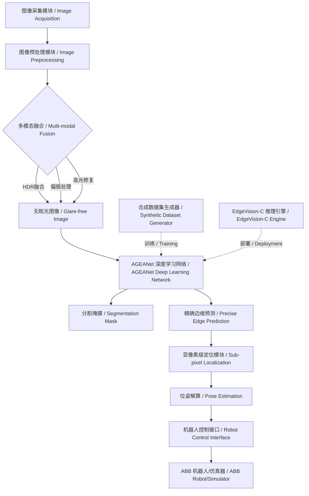
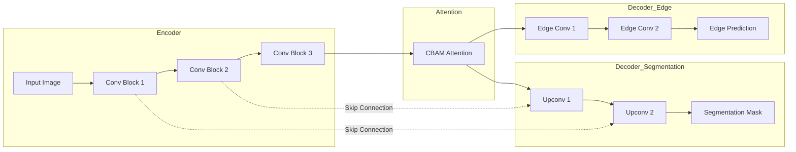
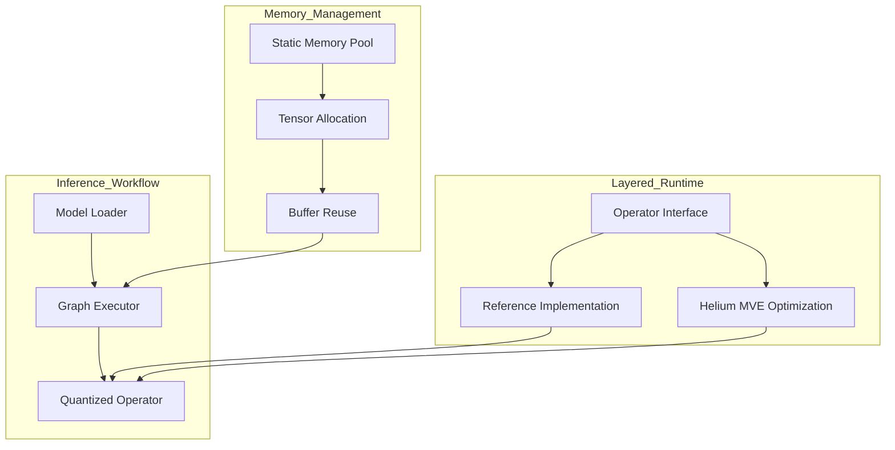

# 专利说明书附图 (Patent Drawings)

## 图 1: 系统总体架构示意图 (System Overall Architecture)

```mermaid
graph TD
    A[图像采集模块 / Image Acquisition] --> B[图像预处理模块 / Image Preprocessing]
    B --> C{多模态融合 / Multi-modal Fusion}
    C -->|HDR融合| D[无眩光图像 / Glare-free Image]
    C -->|偏振处理| D
    C -->|高光修复| D
    D --> E[AGEANet 深度学习网络 / AGEANet Deep Learning Network]
    E --> F[分割掩膜 / Segmentation Mask]
    E --> G[精确边缘预测 / Precise Edge Prediction]
    G --> H[亚像素级定位模块 / Sub-pixel Localization]
    H --> I[位姿解算 / Pose Estimation]
    I --> J[机器人控制接口 / Robot Control Interface]
    J --> K[ABB 机器人/仿真器 / ABB Robot/Simulator]
    L[合成数据集生成器 / Synthetic Dataset Generator] -.->|训练 / Training| E
    M[EdgeVision-C 推理引擎 / EdgeVision-C Engine] -.->|部署 / Deployment| E
```

## 图 2: AGEANet 网络结构示意图 (AGEANet Architecture)

```mermaid
graph LR
    subgraph Encoder
        E1[Input Image] --> E2[Conv Block 1]
        E2 --> E3[Conv Block 2]
        E3 --> E4[Conv Block 3]
    end
    subgraph Attention
        E4 --> CBAM[CBAM Attention]
    end
    subgraph Decoder_Segmentation
        CBAM --> D1[Upconv 1]
        D1 --> D2[Upconv 2]
        D2 --> Mask[Segmentation Mask]
    end
    subgraph Decoder_Edge
        CBAM --> E_D1[Edge Conv 1]
        E_D1 --> E_D2[Edge Conv 2]
        E_D2 --> Edge[Edge Prediction]
    end
    E2 -.->|Skip Connection| D2
    E3 -.->|Skip Connection| D1
```

## 图 3: EdgeVision-C 引擎架构图 (EdgeVision-C Engine Architecture)

```mermaid
graph TD
    subgraph Layered_Runtime
        A[Operator Interface] --> B[Reference Implementation]
        A --> C[Helium MVE Optimization]
    end
    subgraph Memory_Management
        D[Static Memory Pool] --> E[Tensor Allocation]
        E --> F[Buffer Reuse]
    end
    subgraph Inference_Workflow
        G[Model Loader] --> H[Graph Executor]
        H --> I[Quantized Operator]
    end
    B --> I
    C --> I
    F --> H
```
