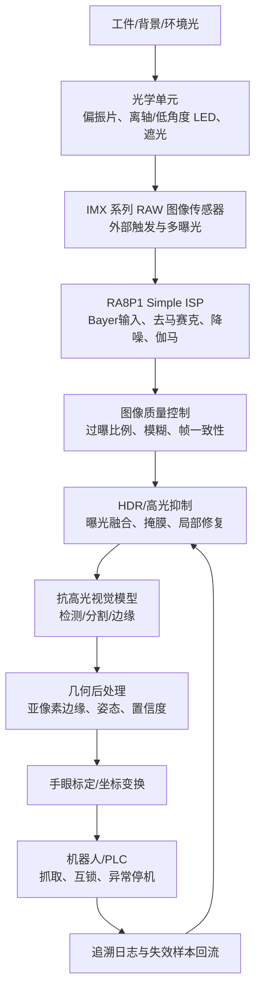
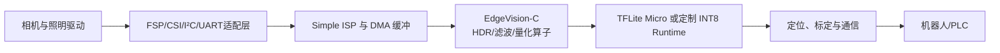

# 高反光工件抗干扰嵌入式 2D 视觉引导系统
## 技术白皮书：从光学采集到 RA8P1 边缘部署的可验证方案

**版本：** v0.5.0 Technical Preview  
**作者：** RussellCooper 项目团队  
**目标读者：** 制造企业技术负责人、自动化集成商、嵌入式开发人员、技术尽调人员

> **工程声明。** 本文档描述的是一个可验证的技术架构与当前代码资产，不是对所有工件、所有现场光照或所有硬件组合的性能保证。代码库中的 PC 单元测试、C 算子原型、传感器寄存器辅助和机器人接口模板，不能替代目标相机模组、镜头、光源、RA8P1 板卡、机器人和实际工件上的硬件在环（HIL）验证。

## 摘要

高反光金属表面的镜面反射会将局部像素推入饱和区，并制造不稳定的高亮条纹、倒影和伪边缘。此时，单张普通 2D 图像中的强度梯度不再可靠：真正的轮廓可能被遮蔽，虚假的亮暗交界则可能被错误地当成轮廓。公开研究将眩光、过曝、信息遮蔽与曲面/小缺陷形态变化列为高反光表面视觉检测的重要困难。[1]

本方案采用五层协同路径：**光源几何与偏振控制、RAW 传感器曝光控制、Simple ISP 图像预处理、多曝光/HDR 与抗高光模型、亚像素定位和机器人闭环**。这一路径的目标不是承诺用软件“恢复所有饱和信息”，而是在饱和发生前尽量保留可用数据；一旦局部饱和不可避免，则通过多曝光、空间上下文、模型置信度与抓取安全策略降低误判风险。

| 设计目标 | 技术手段 | 必须在项目现场验证的内容 |
|---|---|---|
| 减少镜面高光遮蔽 | 偏振、离轴/低角度照明、遮光、短曝光 | 光通量、景深、曲率与姿态敏感性 |
| 保留亮暗区域细节 | 短/中/长曝光、HDR 融合、RAW/ISP 参数 | 传感器时序、运动模糊、帧间对齐 |
| 剔除伪边缘 | 高光掩膜、边缘感知网络、几何后验约束 | 不同材质、油污、背景和 SKU 泛化 |
| 支持边缘侧运行 | INT8 量化、静态内存池、Helium/MVE 算子 | 板端周期数、RAM、热设计和稳定性 |
| 保证抓取闭环 | 手眼标定、置信度门控、机器人通信 | 抓具公差、机器人重复定位与安全联锁 |

## 1. 问题定义与系统边界

### 1.1 高反光成像为何困难

金属镜面或近镜面表面上的入射光可产生强烈定向反射。摄像机若接收到的反射能量超过像素满阱容量或模拟前端范围，局部就会剪裁为近饱和值；剪裁后，单帧算法通常无法从该区域恢复已丢失的强度和纹理信息。对于弯曲工件，反射方向还随局部法线而变化，使固定光源下的光斑位置随姿态改变。相关研究指出，强镜面反射会造成过曝与畸变，并降低缺陷或结构信息可见性。[1]

本系统只覆盖**面向分拣与抓取的 2D 平面/近似平面定位问题**。当任务必须测量高度、深度、遮挡层级或复杂自由曲面 6D 位姿时，应评估双目、结构光、ToF 或其他 3D 路线，而不应强行将其归入本 2D 产品范围。

### 1.2 验收指标的工程化定义

指标必须由客户工位明确：样本范围、照明状态、相机参数、工件摆放、机器人抓具、节拍计时起止点、置信度阈值和人工复核规则。下表为建议格式，而非预设承诺。

| 指标 | 建议定义 | 数据采集方式 | 常见误区 |
|---|---|---|---|
| 识别成功率 | 正确检出且输出有效位姿的工件比例 | 按批次记录真值、检测结果与置信度 | 用挑选过的“好图”替代随机产线样本 |
| 误检率 | 将非工件/高光噪点输出为工件的比例 | 包含空料、背景反光、遮挡样本 | 只统计有工件的图像 |
| 平面定位误差 | 视觉坐标映射到抓取平面的 XY 偏差 | 标定板、机械基准或独立测量系统 | 用像素误差直接声称毫米精度 |
| 角度误差 | 工件主方向与参考方向差值 | 旋转治具或高精度编码器 | 忽略对称工件的方向歧义 |
| 节拍 | 从触发到坐标就绪的端到端时延 | 硬件触发、ISP、推理、通讯的时间戳 | 只测模型推理，不测采集和通讯 |
| 稳定性 | 固定工况下长期漂移、掉帧、异常恢复能力 | 8–24 小时连续运行日志 | 只给出一次性演示结果 |

## 2. 总体架构

架构采用“前端降低光学不确定性、后端降低决策不确定性”的原则。偏振与照明几何用于减少直接反射；多曝光与 ISP 用于保留动态范围；模型和几何约束用于在残余干扰中估计工件；闭环日志用于识别长期漂移和建立再训练数据集。

## 3. 光学设计：先降低眩光，再交给算法

### 3.1 偏振与照明几何

线偏振器可用于降低一部分具有偏振特征的镜面反射。在理想线偏振近似下，分析器旋转角为 $\theta$ 时，透过强度可用马吕斯定律描述：

$$
I(\theta)=I_0\cos^2\theta
$$

交叉偏振常能降低特定方向的反光，但也会显著降低可用光通量。工业光学资料指出，偏振方案的有效性受到光源、曲率和观察几何影响；改变光源—相机几何在一些场景下可优先或补充偏振方案。[2] 因此，设计流程不应直接采购偏振片，而应做光学 DOE。

| 光学变量 | 可选项 | 主要影响 | DOE 记录项 |
|---|---|---|---|
| 光源几何 | 同轴、环形、离轴、低角度条光、背光 | 高光位置、边缘对比、阴影 | 过曝面积、边缘 SNR、定位误差 |
| 偏振关系 | 无偏振、单偏振、交叉偏振、可旋转分析器 | 高光抑制与通光量 | 灰度直方图、曝光时间、温升 |
| 波长 | 白光、红光、近红外（取决于传感器） | 材质反射、环境光、传感器量子效率 | 反射对比、快门余量、串扰 |
| 镜头 | 焦距、光圈、远心/普通镜头 | 畸变、景深、倍率稳定性 | 标定残差、边缘清晰度、FOV |
| 遮光 | 罩体、消光内壁、环境光隔离 | 顶灯/自然光扰动 | 日夜/灯光切换下的漂移 |

### 3.2 光学选型原则

对于平坦镜面件，可从离轴光或交叉偏振开始；对于双向曲面件，应扩大姿态样本、评估多光源方向和偏振余量。不要以“图像看起来更暗”当作抑光成功，而应以**高光面积下降、工件真实边缘可见性提高、所需曝光时间和运动模糊仍在预算内**作为联合指标。

## 4. 传感器、RAW 与 Simple ISP

### 4.1 传感器控制原则

项目代码中包含 IMX 传感器配置辅助和动态高光控制原型。对任何具体 IMX 模组，曝光、模拟增益、黑电平、HDR 模式和帧时序都必须以该模组的正式数据手册和 BSP 为准。不同型号、不同桥接板和不同驱动的寄存器映射、单位和写入时机可能不同；不能把代码中的地址或数值视为跨型号通用生产配置。

高反光工位的基础策略是：在保证暗部可用的前提下，尽量保持较低模拟增益，并使用短曝光保存高光区细节；需要更大动态范围时，采用传感器 HDR 或外触发多曝光序列。任何多曝光策略都必须评估工件运动、传送带抖动和帧间错位。

### 4.2 Simple ISP 的职责

RA8P1 Simple ISP 被设计为承接 Bayer RAW 输入和基础图像处理。系统逻辑将 ISP 视作“稳定输入生成器”，而不是抗反光问题的唯一解决者。

| ISP 阶段 | 建议目的 | 关键风险 | 验证方式 |
|---|---|---|---|
| 黑电平/数字增益 | 修正偏置，避免暗部无谓放大 | 高增益放大噪声和高光剪裁 | 暗场、灰阶卡、直方图 |
| 去马赛克 | 获取稳定 RGB/YUV 结构 | 彩色伪影变成错误边缘 | 斜边、棋盘格、金属纹理 |
| 2D/3D 降噪 | 降低随机噪声与帧间波动 | 过强滤波抹去细边/划痕 | MTF、边缘宽度、时序一致性 |
| 边缘增强 | 提升低对比轮廓可见性 | 把光斑边缘增强成伪边缘 | 真实轮廓/高光边界混淆率 |
| 伽马/颜色矩阵 | 改善视觉动态范围与模型输入一致性 | 训练/部署域不一致 | 训练集与板端输出色彩统计 |
| AE/AWB | 对缓慢环境变化自适应 | AE 引入帧间不一致 | 固定/动态两种策略 A/B 测试 |

## 5. HDR 与高光抑制算法

### 5.1 多曝光融合

对齐的多曝光帧记为 $I_k(x)$，可通过权重融合形成输出 $I_F(x)$：

$$
I_F(x)=\frac{\sum_{k=1}^{K} w_k(x) I_k(x)}{\sum_{k=1}^{K} w_k(x)+\epsilon}
$$

其中 $w_k(x)$ 可综合局部对比、饱和度、曝光适度与高光惩罚。项目代码中提供 Mertens 融合、Debevec HDR、合成曝光序列和高光掩膜功能。其适用前提是多帧之间存在可接受的对齐；对于快速运动工件，必须通过硬触发、短总采集窗口或选择传感器原生 HDR 模式降低重影风险。

### 5.2 高光掩膜与置信度策略

高光掩膜不应仅以阈值作为最终判据，而应作为模型和几何后处理的辅助信号：

1. 在输入层记录饱和比例与高光区域位置；
2. 在模型层利用光斑增强训练，并对高光覆盖区域采用置信度折扣或辅助掩膜；
3. 在几何层要求有效轮廓满足面积、形状、连续性与工件先验；
4. 在执行层当高光覆盖关键抓取区域或置信度不足时，输出“需复拍/拒绝抓取”而非猜测坐标。

公开研究表明，将偏振成像与多尺度边缘信息和深度检测网络结合，可以改善高度反光复杂表面场景下的检测性能；但这种结果依赖研究中的数据集、光学系统和评价协议，不能直接作为本项目的性能结论。[1]

## 6. 抗高光模型与定位链路

项目可在 AGEANet 风格的分割/边缘模型与 YOLO 风格的检测模型之间根据场景选择。推荐的量产链路不是只输出一个边界框，而是“粗定位—语义掩膜/边缘—亚像素精修—形状约束—坐标变换”。

| 模块 | 输入/输出 | 作用 | 失败模式与保护 |
|---|---|---|---|
| 光斑模拟增强 | 图像、工件掩膜 → 增强样本 | 扩大反光形态覆盖 | 合成与真实域差异；以真实失效样本回流修正 |
| 检测/分割模型 | ISP/HDR 图像 → 候选工件 | 排除背景，给出类别/区域 | 反光伪边缘、遮挡、SKU 混淆；使用负样本和置信度门控 |
| 边缘精修 | 候选区域 → 亚像素轮廓 | 提升抓取基准稳定性 | 饱和区域导致边缘中断；剔除或复拍 |
| 姿态估计 | 轮廓/关键点 → $x,y,\theta$ | 计算抓取方向 | 对称件存在角度多解；由工装/抓取策略定义等价方向 |
| 手眼变换 | 像素/相机坐标 → 机器人坐标 | 输出机器人目标位姿 | 标定漂移；加入周期性校验工件/标定板 |

## 7. RA8P1 嵌入式部署路径

### 7.1 软件分层

嵌入式端的关键不是“把 PC 模型直接复制到 MCU”，而是同时控制模型规模、张量内存、算子支持、图像分辨率、数据搬移和中断/通信时序。项目已包含静态内存池、INT8 卷积参考实现、Helium/MVE 条件编译版本、HDR 算子原型、模型导出脚本与 CMake/Mock 框架。这些资产可以缩短工程起步时间，但尚不构成板端实时性或数值一致性的证明。

### 7.2 MVE/Helium 优化原则

Arm 将 Helium/MVE 定位为适合低功耗嵌入式和边缘 AI 的向量计算能力。[4] 实际优化应以 profiler 结果为依据：优先处理高占比算子、保证 16 字节对齐、减少格式转换、复用 DMA 缓冲、对尾部元素设置安全路径。任何“加速倍数”必须在固定编译器版本、优化选项、频率、数据布局、模型和热状态下测量。

| 优化对象 | 预期收益来源 | 验证方法 |
|---|---|---|
| HDR 融合 | 8/16 位定点 MAC 的向量化与减少拷贝 | cycle counter、帧耗时、输出 PSNR/差分 |
| 量化卷积 | INT8 数据布局与向量点积 | 每层耗时、结果与参考实现最大误差 |
| 内存池 | 避免动态分配与碎片 | 峰值 RAM、长期运行稳定性 |
| 图像流水线 | DMA/ISP/CPU 重叠、减少颜色空间变换 | 端到端时序追踪 |

## 8. 性能验证计划

本项目把性能数字分为“目标”“仿真/单元测试”和“板端实测”三类。当前可明确确认的是：仓库的抗高光核心测试覆盖光斑合成、多曝光顺序、高光掩膜、Mertens 融合和非法输入，共五项无硬件测试在标准 Python 环境中通过。除此之外，任何识别率、毫秒级时延、亚像素精度、成本节约都需要按下表验证。

| 验证层级 | 环境 | 样本与工况 | 最小输出 |
|---|---|---|---|
| L0：代码单测 | PC | 合成与固定测试图 | 通过/失败、回归记录 |
| L1：台架成像 | 目标相机/镜头/光源 | 三种材质、姿态、油污、照度波动 | 原始 RAW、ISP 输出、过曝比例、边缘评分 |
| L2：算法盲测 | 固定台架 | 训练/验证/盲测严格隔离 | 检出率、误检率、定位/角度误差与置信区间 |
| L3：板端 HIL | RA8P1 与目标模组 | 温度、电压、连续运行、触发节拍 | 端到端延迟、RAM、掉帧、温升、故障恢复 |
| L4：现场试产 | 客户产线 | 班次、背景变化、真实节拍、机器人抓取 | 抓取成功率、异常分类、人工干预、停机记录 |

建议通过设计实验（DOE）而非单因素“调到看起来最好”来评估光源角度、偏振角、曝光组合、增益、ISP 降噪和模型阈值。对于每一组参数，至少记录：原始帧、HDR 输出、模型输出、真实标签、时序日志和是否成功抓取。

## 9. 安全、可靠性与运维

视觉结果直接影响机器人运动，因此系统必须设计为“低置信度不动作”。建议至少实现以下保护：相机断流检测、图像质量检测、模型版本签名、标定版本追溯、置信度与禁入区门控、机器人响应超时、PLC 急停链独立于视觉软件、异常样本留存和可回滚配方。

| 风险 | 最低保护机制 |
|---|---|
| 高光覆盖抓取基准 | 复拍、切换短曝光或拒绝抓取 |
| 相机/ISP 异常 | 帧计数器、CRC/尺寸检查、重连策略、报警 |
| 模型漂移 | 版本锁定、灰度发布、失效样本审查、回归集 |
| 标定失效 | 标定版本、日常检查件、残差阈值、维护工单 |
| 通讯失败 | ACK、重试上限、超时降级、机器人安全位 |
| 权限与数据 | 本地脱敏日志、最小权限、客户数据隔离 |

## 10. 已知限制与下一步

本技术预览目前的关键限制是缺少与指定硬件 BOM、特定 IMX 模组、产线光学包和机器人抓具绑定的 HIL 与试产数据。下一步优先级应是：

| 优先级 | 工作项 | 产出 |
|---|---|---|
| P0 | 锁定首个目标工件族与验收协议 | 可测量的误检、节拍、误差边界 |
| P0 | 建立光学/传感器台架和 DOE | 选定镜头、光源、偏振与曝光配方 |
| P0 | 在 RA8P1 板端跑通真实 RAW → ISP → 推理 | 编译、内存、时延、温升和稳定性证据 |
| P1 | 采集真实失效样本并训练/量化 | 盲测报告、模型卡、版本管理 |
| P1 | 机器人 HIL 与安全联锁验证 | 抓取测试、异常策略、FMEA |
| P2 | 多客户/多 SKU 复制 | 产品 BOM、安装手册、SLA 与报价模板 |

## 参考资料

[1] [Yu, Wang, Wu, *Defect Detection Method for Large-Curvature and Highly Reflective Surfaces Based on Polarization Imaging and Improved YOLOv11*, *Photonics*, 2025](https://www.mdpi.com/2304-6732/12/4/368)  
[2] [Advanced Illumination, *Lighting Technique: Using Polarizing Filters in Machine Vision*](https://advancedillumination.com/application-notes/using-polarizing-filters-in-machine-vision/)  
[3] [MarketsandMarkets, *Machine Vision Market Size, Share & Trends*, 2025](https://www.marketsandmarkets.com/Market-Reports/industrial-machine-vision-market-234246734.html)  
[4] [Arm, *Arm Helium Technology*](https://www.arm.com/technologies/helium)  
[5] [项目证据笔记：`docs/research/evidence_notes_2026-08.md`](../research/evidence_notes_2026-08.md)  
[6] [抗高光核心单元测试：`tests/test_antiglare_core.py`](../../tests/test_antiglare_core.py)
